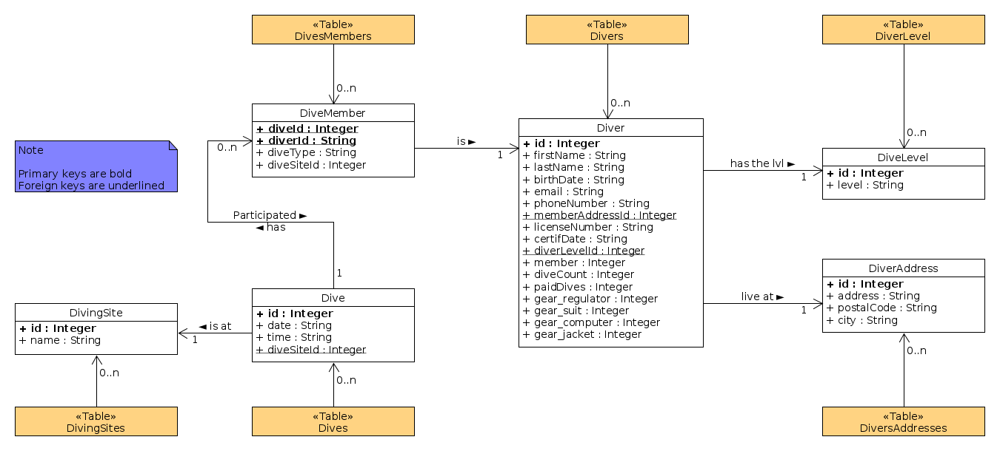

# CPSMGestionPlongees

## Database

This project uses SQLite3 to store data locally.

Data representation is available in the folder **UML**. The scheme was edited using the software [UMLet](https://www.umlet.com/)

